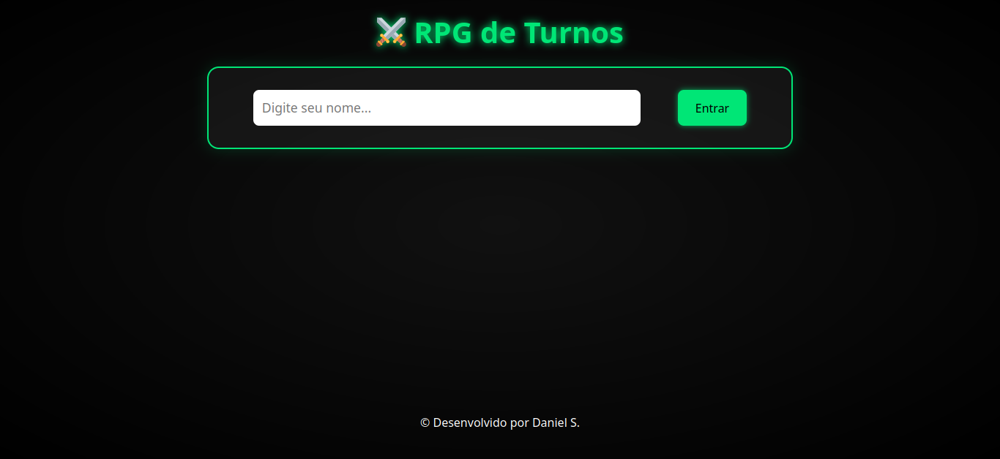
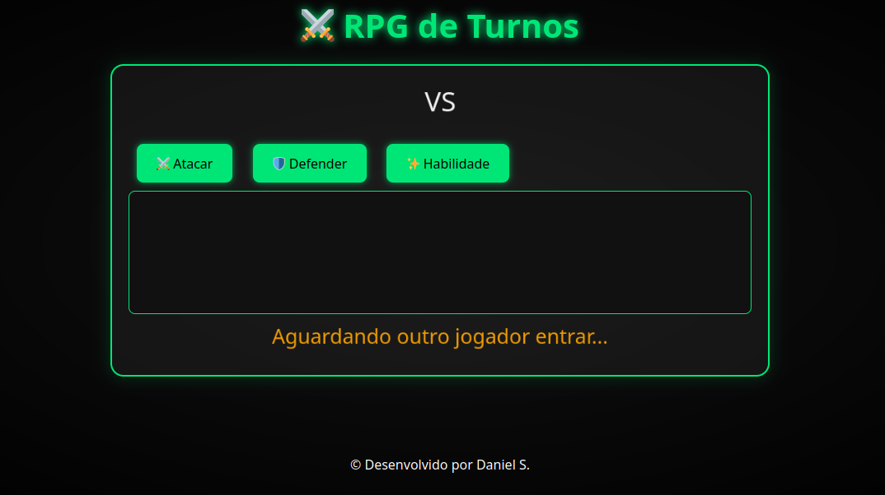

# ⚔️ Jogo de RPG de Turnos - Multiplayer Online

## Visão Geral

Este é um jogo multiplayer de RPG de turnos online, desenvolvido com Node.js, Express e Socket.IO, onde dois jogadores se enfrentam alternando ataques, defesas e habilidades especiais. Ganha quem reduzir a vida do oponente a zero primeiro!

## Funcionalidades 🚀 

- 🎮 Nome de entrada dos jogadores

- 🔄 Turnos alternados entre os jogadores

- 🛡️ Defesa temporária

- ✨ Habilidade especial com uso único por partida

- 📉 Vidas iniciam em 100 e vão sendo reduzidas

- 🔁 Reinício automático da partida

- 💬 Mensagens em tempo real para ambos os jogadores <strong>(EM BREVE!)</strong>

- 🧠 Reset automático após desconexão de um jogador

## 🛠️ Tecnologias Utilizadas

   - Node.js
   - Express
   - Socket.IO
   - Helmet
   - dotenv
   - HTML5 + CSS3 (com animações responsivas)

## Estrutura do Projeto 📁 
```
📦 RPG-ONLINE
├── LICENSE
├── package.json
├── package-lock.json
├── public
│   ├── assets
│   │   └── nerd.ico
│   ├── css
│   │   ├── animacao.css
│   │   ├── responsivo.css
│   │   └── style.css
│   ├── index.html
│   └── js
│       └── jogo.js
├── README.md
├── src
│   ├── backend
│   │   └── server.ts
│   └── index.ts
└── tsconfig.json
```

# Como Executar 💻 

### Passos

#### Clone o repositório:

``` bash
git clone https://github.com/DanielDeveloperBR/RPG-online
cd rpg-turnos
```

## Instale as dependências:
``` bash
npm install "cors": "^2.8.5",
   "dotenv": "^16.5.0",
   "express": "^5.1.0",
   "helmet": "^8.1.0",
   "http": "^0.0.1-security",
   "prompt-sync": "^4.2.0",
   "socket.io": "^4.8.1"
   "ts-node": "^10.9.2",
   "typescript": "^5.8.3"
```

- Crie um arquivo .env se necessário (pode conter variáveis como PORT, etc):


## Execute o servidor:

```npm run dev```

## Acesse no navegador:

http://localhost:3000

#### Abra em dois navegadores / janelas diferentes para jogar!


## Imagens 📷
<h3>Tela inicial<h3>
 
<br>
<h3>Um jogador aguardando<h3>
 

## Detalhes Técnicos

- O backend usa classes TypeScript para gerenciar a lógica do jogo.

- A comunicação é feita com Socket.IO, permitindo ações em tempo real.

- O jogo possui gerenciamento de desconexões, reinicialização automática e controle de turno com validação.

- O frontend é responsivo e tem elementos visuais animados.

## 🧙 Autor

<p>Desenvolvido com por <strong><a href="https://danielondeveloper.vercel.app/" target="_blank">Daniel S.</a></strong> 💻</p>

## Contato

Fique à vontade para entrar em contato comigo por meio do meu [e-mail](mailto:danieldetrabalho1@gmail.com) ou visite meu perfil no [GitHub](https://github.com/DanielDeveloperBR).
